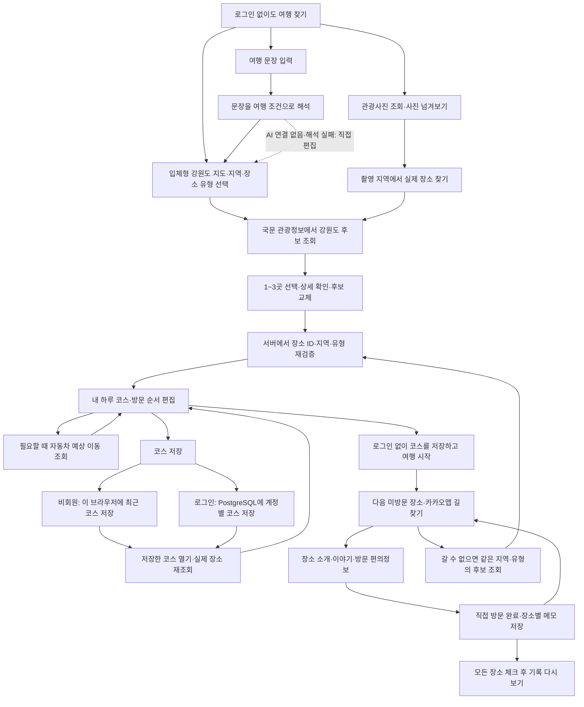
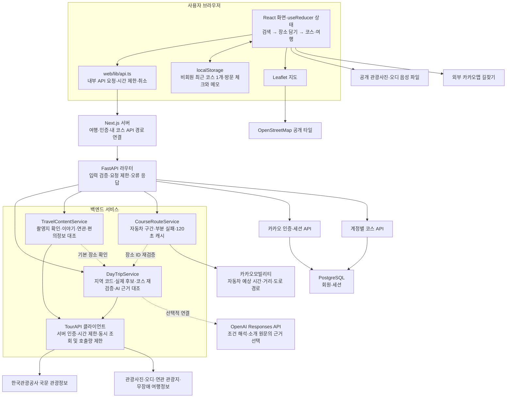
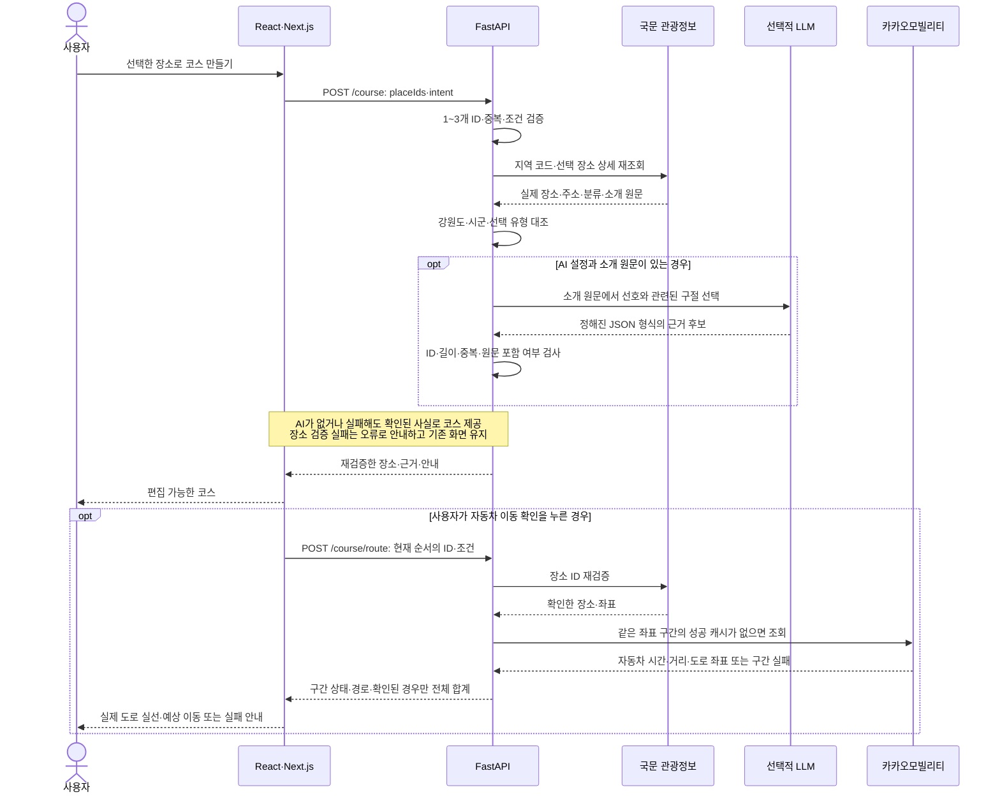

# StoryRoute

원하는 여행을 말하거나 사진을 보며 실제 관광 장소를 골라 나만의 강원도 하루 코스를 만드는 반응형 웹 서비스다. 한 사람이 프런트와 백엔드를 개발하며, 최대 세 장소를 선택한다. 한두 장소로도 코스를 만들 수 있다.

강원특별자치도 전체 검색과 18개 시·군 선택을 지원한다. 관광사진에서 지역을 발견하고 장소 상세에서 오디 원본 이야기와 기준월 연관 관광지를 살펴볼 수 있다. 데이터 판단은 [강원도 API 선정안](docs/API_SELECTION_GANGWON.md)을 따른다.

## 최신 문서

- [개정 기획서](docs/PROJECT_PLAN.md)
- [강원도 API 선정안](docs/API_SELECTION_GANGWON.md)
- [프런트·API 설계서](docs/FRONTEND_API_SPEC.md)
- [최소 사용자 시나리오](docs/MVP_USER_SCENARIO.md)
- [검증 기록](docs/VALIDATION.md)
- [실제 AI 연결·평가 안내](docs/AI_SETUP_AND_CHECK.md)
- [PostgreSQL 연결·도입 계획](docs/POSTGRESQL_PLAN.md)
- [하루 여행 API 계약](contracts/day-trip.openapi.json)

작업 문서와 화면 안내는 한국어를 기준으로 한다. `storyroute_omx_dev_ready_pack`은 이전 기획의 참고 자료이며 현재 개발 범위는 위 문서를 따른다.

## 기술 구성

| 영역 | 구성 |
|---|---|
| 프런트 | React 19·TypeScript·Next.js 15·CSS Modules |
| 백엔드 | Python·FastAPI·httpx |
| 관광 정보 | 한국관광공사 국문 관광정보 서비스, KorService2 |
| 추가 콘텐츠 | 관광사진·오디·관광지별 연관 관광지·무장애 여행정보 서비스 |
| AI | 선택적으로 OpenAI Responses API 구조화 출력 |
| 지도 | Leaflet·OpenStreetMap |
| 자동차 이동 | 카카오모빌리티 예상 시간·거리·도로 경로 |
| 개인 저장 | 비회원은 이 브라우저에 최근 코스·직접 방문 체크·메모 저장 |
| 로그인·서버 DB | 카카오 로그인, PostgreSQL 회원·세션·계정별 코스 저장·조회·삭제 |

기존 저장소의 Next.js 구조에서 React 프런트를 구현한다. 개발·운영 모두 Next.js의 경로 연결로 `/api/v1/day-trip` 요청을 FastAPI에 전달한다.

## 사용 흐름

처음 접속하면 ‘지도로 찾기’가 열린다. 입체형 강원도 지도에서 18개 시·군을 바로 고르거나 문장·관광사진에서 시작할 수 있다. 최종 검색 조건을 사용자가 확인하고 실제 후보에서 방문할 곳을 고른다. 코스를 만든 뒤에는 다음 장소·길찾기·이야기·편의정보·방문 완료가 한 화면에서 이어진다. 여행 중 갈 수 없는 장소는 같은 시군·유형의 실제 후보로 교체하고 서버에서 코스를 다시 확인한다.



관광사진의 제목·촬영지·시군이 같으면 한 카드에서 사진을 넘겨 본다. 처음 조회에 같은 풍경만 몰려 있으면 서버가 다른 촬영지 묶음 여섯 개를 목표로 최대 세 페이지를 보충한다. 한 검색의 조회 범위는 원본 API의 다섯 페이지까지다. 조회한 사진을 12장으로 잘라 버리지 않고 유지하며, ‘다른 풍경 더 보기’는 마지막 성공 페이지 다음부터 이어 조회한다. 촬영지·사진 수를 표시하고 PC 세 열·태블릿 두 열·모바일 한 열의 카드 폭을 유지한다. 실패한 이미지는 제외하고 짧게 안내한다. 사진 속 장소가 국문 관광정보의 특정 장소라고 단정하지 않으며, 확인한 촬영 지역의 후보 검색으로 연결한다.

## 프로그램 구조

아래 그림은 현재 프런트가 사용하는 하루 여행 API 경로다. 관광 API 인증과 AI 호출은 FastAPI에서 처리한다. 사진·음성 파일, 지도 타일, 외부 길찾기는 브라우저가 공개 주소로 접근한다.



화면의 서버 응답과 사용자의 선택 상태는 분리한다. 여행 요청은 잠금·요청 식별자·취소 신호로 중복 실행과 오래된 응답의 반영을 막는다. 사진과 상세 콘텐츠도 화면을 닫을 때 요청을 취소한다. 추가 콘텐츠 실패가 기본 장소 소개나 코스 이용을 막지 않도록 각 영역에서 처리한다.

비회원 코스는 `storyroute.day-trip.v2`에 가장 최근 한 개를 저장한다. 로그인은 여행 시작의 필수 조건이 아니며, 카카오 로그인 사용자는 장소 ID·순서·검색 조건을 PostgreSQL의 계정별 코스 목록에 추가로 저장하고 다른 기기에서도 다시 열 수 있다. 코스를 다시 열 때는 저장 당시 내용을 그대로 믿지 않고 관광 API로 현재 장소 정보를 재검증한다. 방문 완료·메모는 `storyroute.journey.v1:` 뒤에 정렬한 장소 ID 집합을 붙여 브라우저에 별도로 저장한다. 순서를 바꾸면 같은 기록을 유지하고, 여행 중 장소를 교체하면 남아 있는 장소의 완료·메모만 새 코스로 옮긴다.

### 코스와 이동정보를 확인하는 순서



순서를 바꾸면 이전 자동차 경로를 숨기고 다시 확인하게 한다. 실패한 구간은 가짜 시간이나 직선 도로로 채우지 않는다. 지도 점선은 방문 순서이며, 예상 이동에는 첫 장소까지의 이동·체류·주차 시간이 포함되지 않는다.

## 실행 준비

Node.js 22.12 이상과 Python 3.12 이상을 권장한다. 아래 명령은 Windows PowerShell에서 프로젝트 루트를 기준으로 실행한다.

```powershell
python -m venv .venv
.\.venv\Scripts\python.exe -m pip install -r requirements.txt
if (-not (Test-Path -LiteralPath '.env')) {
    Copy-Item -LiteralPath '.env.example' -Destination '.env'
}
```

`.env`의 `TOUR_API_SERVICE_KEY`에 공공데이터포털 인증키를 설정한다. 선택적으로 `OPENAI_API_KEY`, `OPENAI_MODEL`을 함께 설정하면 AI 해석과 근거 선택을 사용할 수 있다. 모델은 해당 API 계정에서 구조화 출력을 지원하는 모델을 지정한다. 실제 `.env`의 값은 공개 문서나 코드에 넣지 않는다.

사진·오디오·연관 관광지·무장애 여행정보의 별도 인증 설정은 서버 `.env`에서 아래 항목으로 관리한다. 국문 관광정보의 설정은 그대로 유지한다. 네 서비스를 화면에 연결했다. 없는 콘텐츠나 추가 서비스 오류는 해당 영역에서 안내한다.

| 서비스 | 서버 주소 변수 | 인증키 변수 |
|---|---|---|
| 관광사진 | `PHOTO_API_BASE_URL` | `PHOTO_API_SERVICE_KEY` |
| 오디오 가이드 | `AUDIO_API_BASE_URL` | `AUDIO_API_SERVICE_KEY` |
| 연관 관광지 | `RELATED_API_BASE_URL` | `RELATED_API_SERVICE_KEY` |
| 무장애 여행정보 | `ACCESS_API_BASE_URL` | `ACCESS_API_SERVICE_KEY` |

서버 환경변수를 바꾸면 백엔드를 다시 시작한다. 각 서비스의 지역코드·ID·응답 형태를 별도로 처리한다. `RELATED_API_BASE_MONTH`의 기본값은 실제 조회한 `202504`다. 화면에 자료 기준월을 표시한다. 상태 API의 준비 표시는 설정 여부이며 실제 정상 여부는 조회 결과로 확인한다.

## 백엔드 실행

```powershell
.\.venv\Scripts\python.exe -m uvicorn app.main:app --reload --port 8000
```

- 상태 확인: <http://127.0.0.1:8000/healthz>
- API 문서: <http://127.0.0.1:8000/docs>

## 로컬 PostgreSQL 연결

현재 PC에서는 Docker Compose로 PostgreSQL 17을 프로젝트 전용 `127.0.0.1:55432`에서 실행한다. Docker Desktop의 Containers에서 `storyroute-local-db` 그룹과 `storyroute-local-db-postgres-1` 컨테이너를 확인할 수 있다. 서버 `.env`의 `DATABASE_URL`을 사용하며 로그인 회원·세션과 계정별 코스를 저장한다. 비회원 최근 코스와 모든 방문 체크·메모는 브라우저에 저장한다.

프로젝트 루트에서 DB 실행과 실제 연결·임시 데이터 읽기·쓰기를 확인한다.

```powershell
docker compose up -d --wait
.\.venv\Scripts\python.exe -X utf8 tools/check_local_db.py
docker compose ps

# 개발을 마치고 DB 중지: 저장 볼륨은 유지
docker compose stop
```

SQLAlchemy 모델과 Alembic 초기 변경을 구현하고 현재 로컬 DB에 사용자·세션·코스·장소·기록 테이블을 생성했다. 카카오 로그인 화면과 계정별 코스 저장·목록·재열기·삭제 API가 이 DB에 연결된다. 새 DB에는 아래 명령으로 적용한다.

```powershell
.\.venv\Scripts\python.exe -m pip install -r requirements.txt
.\.venv\Scripts\python.exe -X utf8 -m alembic upgrade head
.\.venv\Scripts\python.exe -X utf8 -m alembic current
.\.venv\Scripts\python.exe -X utf8 tools/check_db_schema.py
```

필드·관계·제약조건과 pgAdmin 확인 방법은 [테이블 구조](docs/DATABASE_SCHEMA.md)를 따른다. 확인용 데이터는 롤백하며 `alembic_version`은 별도 변경 이력 테이블이다.

새 개발 환경은 `.env.example`의 로컬 DB 설정과 같은 비밀번호를 `DATABASE_URL`에 반영한 뒤 실행한다. 이전에 초기화한 Windows PostgreSQL은 중지 상태로 유지한다. 두 방식은 같은 포트를 사용하며 서로 다른 저장 공간을 사용하므로 동시에 실행하거나 같은 DB 데이터로 취급하지 않는다. 상세 실행·중지 방법과 대체 실행 방법은 [PostgreSQL 연결 안내](docs/POSTGRESQL_PLAN.md)를 따른다.

## 프런트 실행

다른 터미널에서 프로젝트 루트를 기준으로 실행한다.

```powershell
Set-Location -LiteralPath web
npm ci
npm run dev
```

화면 주소: <http://localhost:3000>. `web/package-lock.json`을 사용하므로 npm을 기본 패키지 관리자로 사용한다.

백엔드 주소가 다르면 `web/.env.local`의 `API_BASE_URL`을 설정하고 프런트를 다시 시작한다. 기본값은 `http://127.0.0.1:8000`이며 기존 `NEXT_PUBLIC_API_BASE_URL`도 호환한다. 외부 API 비밀키는 이 프런트 설정에 넣지 않는다.

## 구현한 흐름

2026년 9월 20일 로컬 확인 기준이다. 구현 여부와 실제 외부 연결·재생 여부를 구분한다. 상세 검증은 [검증 기록](docs/VALIDATION.md)에 남긴다.

| 기능 | 현재 상태 | 제공 범위 |
|---|---|---|
| 입체형 강원도 지도·관광 검색 | 실제 조회 확인 | 강원도 실제 윤곽·18개 시군 이름·키보드 선택, 명소·문화시설·음식점 후보 |
| 선택·교체·코스 검증 | 구현·실제 로컬 흐름 확인 | 1~3곳, ID·지역·유형 재조회, 순서 편집, 여행 중 같은 시군·유형의 대체 후보 조회·재검증 |
| 관광사진 탐색 | 실제 이미지 로드·실패 처리 확인 | 같은 제목·촬영지 묶음, 사진 넘기기, 지역 검색 연결 |
| 이야기·연관·편의정보 | 실제 자료가 있는 장소와 없는 장소 확인 | 동일 장소 대조, 기준월·출처·누락 안내, 연결 가능한 연관 후보만 추가 |
| 방문 전 실용정보 | 실제 국문 관광 API 응답 확인 | 전화·운영시간·휴무일·주차·요금·대표메뉴 등 장소 유형별 제공 항목만 표시 |
| 원본 음성 재생 | 파일 응답·컨트롤 확인 | 재생 완료는 미확인, 원문·원본 파일 링크 제공 |
| 자동차 이동 | 실제 구간 조회·도로 표시 확인 | 조회 시점 예상값, 부분 실패 처리, 순서 변경 후 재조회 |
| 여행 동반 화면·직접 기록 | 구현·실제 로컬 흐름 확인 | 비회원 출발, 다음 행동, 직전 장소 기준 길찾기, 이야기·편의정보 바로 열기, 방문 완료, 500자 메모, 장소 교체 뒤 기존 기록 유지 |
| 문장 해석·AI 근거 선택 | 실제 Responses API 연결·고정 예시 평가 확인 | 조건 해석 10개·춘천 실제 후보 18개·두 장소 소개 원문 대조, 브라우저·공개 운영 AI 흐름은 별도 확인 |
| 카카오 로그인·계정 저장 | 구현·로컬 실제 로그인 확인 | 회원·세션 DB 저장, 계정별 코스 저장·최대 20개 목록·재검증 후 열기·삭제 |
| PostgreSQL 기반 연결 | 실제 로컬 연결·읽기·쓰기 확인 | DB 연결 확인 API, 연결 수·시간 제한·오류 숨김, 회원·세션·코스 저장 |
| 코스 공유·방문 기록 동기화 | 구현 전 | 방문 체크·메모는 현재 브라우저에만 저장 |
| 공개 운영 주소·제출 자료 | 준비 단계 | 로컬 동작과 별도로 외부 접속·제출 확인 필요 |

후보 카드 표시·선택·순서 변경마다 LLM을 호출하지 않는다. 관광 연결이 없으면 실제 장소를 제공한 것처럼 표시하지 않는다. AI가 없거나 실패해도 직접 조건 선택과 실제 관광 검색을 사용할 수 있다.

## 사용자 관점의 보완 순서

아래 표는 사용자 문제와 처리 결과를 함께 기록한다. 실제 AI 연결·고정 예시 평가와 원문 근거는 확인했다. 다음은 공개 주소에서 기본 흐름을 확인하는 작업이며, 상세 자료의 상태와 저장 안내도 [남은 일정](docs/PROJECT_PLAN.md)에 맞춰 보완한다.

| 우선순위 | 현재 사용자가 겪을 수 있는 문제 | 보완할 내용 | 완료 확인 |
|---|---|---|---|
| 1 | ‘이야기 듣기’를 눌렀는데 자료가 없어 기능 오류처럼 느껴짐 | 조회 전에는 ‘이야기 확인’처럼 표현하고, 조회 후 자료 수·없음·실패를 구분. 같은 상세에서 탭을 돌아와도 확인한 결과 유지 | 자료 있는 장소·없는 장소·조회 실패에서 표시가 서로 다르고, 탭 복귀만으로 API를 재호출하지 않음 |
| 2 | 비회원은 최근 코스 하나만 브라우저에 보관되며 다른 기기에서 이어볼 수 없음 | 현재 저장 범위를 코스 화면에 안내하고 사용자가 원할 때 카카오 로그인으로 계정 저장 | 로그인 창 없이 여행 시작, 로그인·비로그인 저장과 재접속 결과를 각각 확인 |
| 3 | 식당을 골라도 전화·이용시간 등 방문 판단에 필요한 정보가 부족함 | `detailCommon2`와 `detailIntro2`의 장소 유형별 정보를 상세 화면의 ‘방문 전 확인’에 연결함 | 영월 ‘동강의아침’에서 문의·영업시간·휴무일·주차·대표메뉴·취급메뉴 확인. 누락값은 상태를 추정하지 않고 안내만 표시 |
| 4 | 고정 예시 외의 문장·조건 편집과 외부 주소의 AI 흐름은 아직 미확인 | 부정문·모호한 요청 추가 평가, 화면에서 조건 수정 후 실제 검색, 공개 운영에서 실패 대응 확인 | 고정 예시 10개 결과와 추가 검증을 구분하고 AI 실패 중에도 수동 검색 완주 |

다음 단계의 구조 개선은 필요가 확인된 범위부터 한다. 상세 콘텐츠 결과를 상위 상세 패널에서 관리해 조회 상태를 유지하고, 검색 조건 편집·요청 진행·코스 편집의 상태 변경을 명확하게 분리한다. 공개 리뷰·사진 업로드는 이번 제출 범위에서 제외한다. 공개 범위·이미지 저장소·신고와 삭제 정책 없이 추가하면 신뢰와 운영 부담이 커지기 때문이다. 무료 운영과 계정·코스·기록의 관계는 [PostgreSQL 도입 계획](docs/POSTGRESQL_PLAN.md)을 따른다.

## 코드 위치

| 위치 | 역할 |
|---|---|
| `web/components/storyroute` | 세 단계 화면, 입체형 강원도 시군 지도, 조건 편집, 장소 카드·상세, 코스 지도 |
| `web/data/gangwonMap.ts` | 강원도 18개 시군 SVG 경계·이름 위치 데이터 |
| `web/components/auth`·`web/lib/auth.ts` | 카카오 로그인 화면·현재 회원·로그아웃 |
| `web/lib/accountCourses.ts` | 계정별 코스 저장·목록·삭제 요청 |
| `web/lib/api.ts` | 내부 API 요청·시간 제한·오류 처리 |
| `web/lib/storyroute` | 공통 타입·코스 및 여행 기록 저장·외부 길찾기 링크 |
| `app/services/day_trip.py` | 관광 데이터 정리·지역 검증·AI 근거 확인 |
| `app/services/travel_content.py` | 관광사진·오디·연관·무장애 자료와 실제 장소 대조 |
| `app/services/course_route.py` | 자동차 구간 조회·성공 캐시·부분 실패 처리 |
| `app/tour_api/related_region_codes.json` | 공식 코드표의 연관 서비스 강원 시군 코드 |
| `app/api/v1/endpoints/day_trip.py` | 하루 여행 API |
| `app/api/v1/endpoints/account_courses.py` | 로그인 회원의 코스 저장·목록·재열기·삭제 API |
| `app/tour_api/client.py` | 서버에서 관광 API 호출·조회량 제한 |
| `app/database.py` | PostgreSQL 연결 풀·트랜잭션·연결 확인·오류 숨김 |
| `compose.yaml` | 개발용 PostgreSQL 17·로컬 포트·영속 볼륨·상태 확인 |
| `tools/check_local_db.py` | 실제 DB 연결·임시 한국어 데이터 저장·수정·조회 확인 |
| `app/models.py`·`migrations`·`alembic.ini` | 계정·코스·기록 모델과 DB 변경 이력 |
| `tools/check_db_schema.py` | 실제 DB의 제약조건·순서 변경·기록 유지·삭제 검증, 확인용 데이터 롤백 |
| `tools/local_postgres.ps1` | 현재 PC의 프로젝트 전용 PostgreSQL 실행·중지·상태 |
| `tests/test_database.py` | DB 미설정·잘못된 설정·연결 실패·정상 상태·종료 시 정리 |
| `tests/test_day_trip.py` | 외부 키가 필요 없는 흐름·실패 검증 |
| `tests/test_travel_content.py` | 강원도 범위·추가 콘텐츠·장소 연결 검증 |
| `tests/test_course_route.py` | 자동차 응답·좌표 누락·부분 실패·캐시·조회량 제한 검증 |
| `tests/test_account_courses.py` | 계정 코스 저장·순서·소유권·삭제 검증 |
| `web/tests/storage.test.cjs` | 코스·방문 기록 검증과 외부 길찾기 링크 확인 |

기존 인증·관광 원형 API·이전 계약 경로는 같은 서버에 있다. 현재 화면은 하루 여행 API를 사용한다. 이전 서버 저장·행사 기록·관리자 경로는 실제 저장이나 수집이 구현된 것으로 간주하지 않는다.

## 검증

프로젝트 루트:

```powershell
.\.venv\Scripts\python.exe -m pip install -r requirements-dev.txt
.\.venv\Scripts\python.exe -m pytest -q
.\.venv\Scripts\python.exe tools/check_live_tourism.py
.\.venv\Scripts\python.exe tools/check_extra_tourism.py
.\.venv\Scripts\python.exe -X utf8 tools/check_live_ai.py
```

`web` 폴더:

```powershell
npm run typecheck
npm run lint
npm test
npm run build
```

기능 테스트는 모의 관광·AI 응답을 사용하며 서버의 실제 AI 설정을 가져오지 않는다. 관광 연결 확인 명령은 실제 API 호출량을 사용한다. `check_live_ai.py`는 유료 AI 요청을 최대 10회 보내는 별도 예시 평가이며 인증키·인증 URL·오류 원문을 출력하지 않는다. 최근 결과와 미확인 항목은 [검증 기록](docs/VALIDATION.md)에 구분해 기록한다.

## 운영

코스에서 ‘이 코스로 여행 시작’을 누르면 로그인 여부와 관계없이 다음 미방문 장소·길찾기·장소 소개·이야기·편의정보·방문 완료·장소별 메모를 사용할 수 있다. 순서를 바꿔도 같은 장소 구성의 기록은 유지된다. 갈 수 없는 미방문 장소는 현재 검색 조건으로 실제 후보를 다시 불러와 같은 시군·유형의 장소로 교체한다. 교체 결과는 코스 API에서 다시 검증해 현재 브라우저의 코스에 자동 저장하며, 기존 코스에서 남아 있는 장소의 완료·메모는 유지하고 자동차 이동정보는 다시 확인하게 한다. 계정 코스 반영은 사용자가 코스 저장을 눌러 명시적으로 실행한다. 방문 기록은 직접 남긴 값이며 GPS 인증이 아니다. 로그인 사용자의 코스는 계정 DB에 저장되지만 방문 완료와 메모는 현재 브라우저에만 저장된다. 구간 길찾기는 직전 코스 장소와 목적지를 카카오맵에 전달한다. 지도 점선은 방문 순서다. ‘자동차 이동 확인’을 누르면 장소를 재검증하고 실제 예상 시간·거리·도로 경로를 조회한다. 순서를 바꾸면 다시 확인해야 한다. 자동차 기준 조회 시점의 예상값이며 첫 장소까지의 이동·체류·주차 시간은 제외한다. 경로 조회 실패가 코스·기본 길찾기를 막지 않는다. 서버의 기존 `KAKAO_REST_API_KEY`를 사용하며 해당 앱의 길찾기 권한이 필요하다.

프런트는 `npm run build` 후 `npm run start`, 백엔드는 uvicorn으로 각각 운영한다. 프런트의 `API_BASE_URL`이 실제 백엔드에 닿아야 한다. 운영 빌드에 연결 주소가 반영되므로 주소를 바꾸면 다시 빌드한다. 공개 주소 배포와 공모전 제출은 별도 단계다.

개발 서버와 운영 미리보기를 동시에 사용할 때는 빌드·운영 실행 양쪽에 `STORYROUTE_DIST_DIR=.next-preview`를 설정해 산출물 폴더를 분리한다. 일반 실행에는 필요하지 않다. 두 실행에서 서로 다른 값을 쓰면 해당 운영 빌드를 찾지 못한다.

현재 조회량 제한과 지역코드는 메모리에 있다. 백엔드는 한 워커를 기준으로 운영하고, 여러 인스턴스 운영 때는 공유 제한 저장소가 필요하다. 관광 원천 데이터의 대량 영속 저장과 색인은 별도 이용 안내를 확인한 후 확장한다.

## 카카오 회원·세션 저장

카카오 로그인 콜백에서 `users`를 생성하거나 기존 회원을 갱신하고 `auth_sessions`에 로그인 유지용 토큰 해시를 저장한다. 사용자·세션 저장은 한 트랜잭션으로 처리하며 카카오 원본 토큰과 이메일은 DB에 저장하지 않는다. 동일 카카오 계정은 같은 내부 UUID를 사용한다.

접근 토큰도 DB 세션의 만료·폐기 여부를 확인한다. 토큰 갱신은 행 잠금으로 같은 세션의 중복 갱신을 막고, 기존 세션 폐기와 새 세션 생성을 함께 처리한다. 로그아웃 시 해당 세션을 폐기한다. 이전 메모리 방식으로 발급한 쿠키는 다시 로그인해야 한다. 프런트는 로그인 회원의 닉네임·로그아웃·내 코스 목록을 제공한다. 계정 코스에는 장소 ID·순서·검색 조건만 저장하고 다시 열 때 관광 API로 현재 정보를 검증한다. 방문 체크와 메모는 브라우저 저장을 유지한다.

설정·API·로컬 검증 실행은 [카카오 인증 API 설명](docs/AUTH_API_SPEC.md)을 따른다.

## 프로젝트 규칙

### 브랜치

- 기본 브랜치는 `main`과 `dev`이며 두 브랜치에 직접 푸시하지 않는다.
- `dev`에서 작업 브랜치를 만들고 작업 브랜치를 푸시한 뒤 풀리퀘스트로 반영한다.
- 작업 브랜치 이름은 `{타입}-{개발자}-{작업내용}-#{이슈번호}` 형식으로 작성한다.
- 예: `feat-kjs-kakao-login-#1`.

### 커밋

커밋 메시지는 `{접두사}: {내용} (#{이슈번호})` 형식을 사용한다. 내용은 간결한 한국어로 작성한다.

예: `Feat: 강원도 관광지 목록 API 연동 (#3)`.

| 접두사 | 용도 |
|---|---|
| Feat | 새로운 기능 |
| Fix | 버그 수정 |
| Docs | 문서 추가·수정 |
| Style | 스타일링 |
| Refactor | 동작 변경 없는 리팩토링 |
| Test | 테스트 |
| Conf | 빌드·환경 설정 |
| Chore | 기타 작업 |

### 풀리퀘스트

제목은 `[접두사] 내용` 형식을 사용한다. 예: `[Feat] 강원도 하루 여행 구현`.
본문은 저장소의 [풀리퀘스트 템플릿](.github/PULL_REQUEST_TEMPLATE.md)에 따라 변경 내용과 검토할 사항을 한국어로 작성한다.

## 공식 자료

- [한국관광공사 국문 관광정보 서비스](https://www.data.go.kr/data/15101578/openapi.do)
- [Next.js 경로 연결](https://nextjs.org/docs/app/api-reference/config/next-config-js/rewrites)
- [OpenAI 구조화 출력](https://developers.openai.com/api/docs/guides/structured-outputs)
- [Leaflet 지도](https://leafletjs.com/reference.html)
- [OpenStreetMap 타일 이용 안내](https://operations.osmfoundation.org/policies/tiles/)
- [대한민국 시군구 지도 데이터 mapcn-kr](https://github.com/DevMinGeonPark/mapcn-kr) — 통계청 SGIS·행정안전부 자료를 가공한 CC BY 4.0 경계 데이터
- [공모전 안내](https://lowly-polyanthus-1fb.notion.site/2026-36b5dce406e380e0a3d1f80525667a11)
