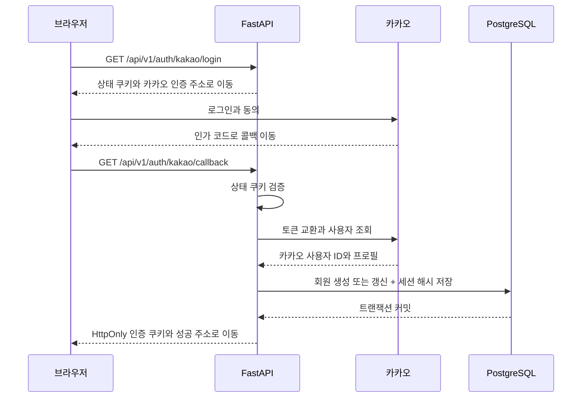

# 카카오 인증 API와 PostgreSQL 연결

2026년 9월 20일 기준. 회원·인증 세션 저장, 프런트 카카오 로그인 상태, 계정별 코스 생성·목록·조회·삭제를 구현했다. 방문 체크와 메모는 현재 브라우저에만 저장한다.

## 처리 흐름



카카오 ID는 `users.provider_user_id`로 저장하며 서비스 내부 사용자 ID는 UUID다. 동일 제공자·사용자 ID의 유일 제약과 PostgreSQL의 충돌 갱신을 사용한다. 닉네임은 최대 100자로 제한하고 재로그인 때 갱신한다. 카카오 원본 토큰·이메일·프로필 사진은 DB에 보관하지 않는다.

세션은 로그인 유지용 토큰의 SHA-256 해시만 저장한다. 접근 토큰과 로그인 유지용 토큰에는 내부 사용자 ID와 세션 ID가 들어간다. 기존 메모리 방식의 쿠키는 호환하지 않으며 한 번 다시 로그인해야 한다. 서버 재시작이나 다른 앱 인스턴스에서도 동일 DB와 JWT 서명을 사용하면 로그인 세션을 조회할 수 있다. 실제 프로세스 재시작의 브라우저 검증은 별도로 남겨 둔다.

## API 계약

| 메서드·경로 | 동작 |
|---|---|
| GET `/api/v1/auth/kakao/login-url` | 기존 OAuth 설정의 활성 여부와 로그인 시작 경로 반환. DB 연결 성공을 보장하는 상태가 아님 |
| GET `/api/v1/auth/kakao/login` | 상태 쿠키를 발급하고 카카오 인증 페이지로 이동. `request_nickname=true`이면 닉네임 추가 동의 요청 |
| GET `/api/v1/auth/kakao/callback` | 상태 검증·카카오 사용자 조회·회원과 세션 저장 후 프런트 성공 주소로 이동. 인증 또는 DB 저장 실패 시 쿠키를 지우고 실패 주소로 이동 |
| GET `/api/v1/auth/me` | 접근 쿠키와 DB의 활성 세션을 확인하고 회원 반환. 미인증은 401 |
| GET `/api/v1/auth/session` | `ok`, `authenticated`, `hasRefreshToken`, `user` 반환. 미인증은 200과 `authenticated: false`. `hasRefreshToken`은 쿠키 존재 여부이며 유효성 판정이 아님 |
| POST `/api/v1/auth/refresh` | 세션 행 잠금·만료와 폐기 및 해시 검증·기존 세션 폐기·새 세션 저장 후 쿠키 갱신 |
| POST `/api/v1/auth/logout` | 유효한 로그인 유지용 쿠키에 해당하는 세션을 폐기하고 인증 쿠키 삭제 |
| POST `/api/v1/account/courses` | 로그인 사용자의 코스 제목·조건·장소 ID와 순서를 저장 |
| GET `/api/v1/account/courses` | 로그인 사용자의 최근 코스 최대 20개 조회 |
| GET `/api/v1/account/courses/{course_id}` | 소유권을 확인한 계정 코스 단건 조회 |
| DELETE `/api/v1/account/courses/{course_id}` | 소유권을 확인한 계정 코스와 장소 삭제 |

회원 응답은 `userId`, `provider`, `nickname`이다. `userId`는 내부 UUID 문자열이며 외부 카카오 ID를 프런트에 전달하지 않는다. 이메일 필드는 반환하지 않는다.

인증 응답에는 `Cache-Control: no-store`를 적용한다. DB 오류는 503과 한국어 안내를 반환하고 연결 주소·비밀번호·SQL 원문은 노출하지 않는다. DB 장애를 미인증 성공 응답으로 감추지 않는다. DB가 없어도 기본 관광 검색과 `/healthz`는 유지된다.

토큰 갱신은 `SELECT FOR UPDATE`로 같은 세션을 잠근다. 먼저 갱신된 세션은 폐기 상태가 되어 재사용을 거절한다. 새 토큰 저장에 실패하면 기존 세션 폐기도 롤백한다. 폐기·만료된 세션은 접근 토큰도 거절한다. 다른 기기의 별도 세션까지 로그아웃하지 않는다. 만료·폐기 행의 주기적 정리는 이후 운영 단계다.

## 로컬 설정과 확인

서버 `.env`에 `DATABASE_URL`, `AUTH_JWT_SECRET`(최소 32자), `KAKAO_REST_API_KEY`, `KAKAO_CLIENT_SECRET`, `KAKAO_REDIRECT_URI`, `AUTH_FRONTEND_SUCCESS_URL`, `AUTH_FRONTEND_FAILURE_URL`을 설정한다. 카카오 로그인과 시크릿 활성화를 확인하고 동일 REST API 키의 리다이렉트 URI를 콜백 주소와 정확히 맞춘다. 프런트 주소와 `CORS_ORIGINS`도 실행 포트와 맞춘다. 비밀 값은 서버 환경파일에만 넣는다.

테이블 준비는 프로젝트 루트에서 실행한다.

```powershell
.\.venv\Scripts\python.exe -X utf8 -m alembic upgrade head
```

실제 카카오 로그인 후 프런트 헤더의 닉네임·내 코스·로그아웃과 백엔드 `/api/v1/auth/me`의 회원 응답을 함께 확인한다. 계정 코스를 저장하고 목록에서 다시 열 때 관광 API로 장소를 재조회하는 흐름까지 확인한다. 콜백의 성공 리다이렉트만으로 프런트 연동·코스 저장이 끝났다고 판단하지 않는다.

## 자동 검증

일반 테스트는 외부 DB·카카오를 호출하지 않는다. 로컬 PostgreSQL 인증 검증은 명시적으로 켠다.

```powershell
$env:STORYROUTE_TEST_DATABASE = "1"
.\.venv\Scripts\python.exe -X utf8 -m pytest -q
Remove-Item Env:STORYROUTE_TEST_DATABASE
```

실제 DB 테스트는 `127.0.0.1:55432/storyroute`에서만 실행하며 테스트 회원·세션을 트랜잭션으로 롤백한다. 카카오 사용자 조회는 모의 응답이다. 중복 가입 방지·닉네임 갱신·해시 저장·새 앱의 기존 세션 조회·갱신 후 재사용 거절·로그아웃·만료·해시 불일치·트랜잭션 실패를 확인한다. 동시 요청의 부하 검증과 실제 사용자 재로그인 확인은 별도다.

## 기존 회원의 닉네임 추가 동의

앱에서 닉네임을 선택 동의로 설정해도 이미 연결된 회원의 일반 로그인에서 동의 화면이 다시 나타나지 않을 수 있다. 닉네임 제공에 동의하려는 사용자는 `/api/v1/auth/kakao/login?request_nickname=true`로 로그인한다. 서버가 고정된 `scope=profile_nickname`을 카카오 인가 요청에 포함한다. 임의의 동의항목을 클라이언트 입력으로 받지 않으며 일반 로그인은 기존 요청을 유지한다. 앱의 닉네임 동의항목을 먼저 사용 설정해야 한다. 이미 동의한 항목은 화면이 생략될 수 있으므로 `/api/v1/auth/me`와 DB의 닉네임을 확인한다.

참고: [카카오 REST API 추가 동의 안내](https://developers.kakao.com/docs/ko/kakaologin/rest-api).
