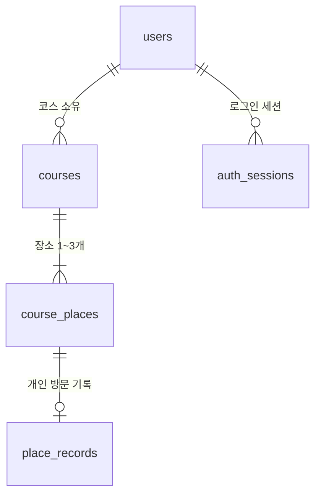

# PostgreSQL 테이블 설계

2026년 9월 20일 현행화 · SQLAlchemy 모델·초기 Alembic 마이그레이션 구현 및 로컬 DB 적용 완료.

로그인 유지와 사용자별 코스 저장에 필요한 테이블을 생성했다. 카카오 로그인은 `users`와 `auth_sessions`에, 계정별 코스는 `courses`와 `course_places`에 연결했다. 방문 체크·개인 메모는 현재 브라우저에만 저장하며 `place_records`는 향후 계정 동기화를 위한 확장 구조로 아직 API에 연결하지 않았다. 공개 리뷰·사진 업로드는 이번 범위에서 제외했다.

## 관계



UUID는 서버에서 생성하고 시간은 `timestamptz`로 저장한다. 생성·수정 시각은 서버가 관리하며 화면에서 한국 시간으로 표시한다. 별도 표시가 없는 필드는 필수다.

## 1. users — 사용자

| 필드 | PostgreSQL 타입 | 조건·용도 |
|---|---|---|
| id | uuid | 기본키, 서비스 내부 사용자 ID |
| provider | varchar(20) | 현재 `kakao` |
| provider_user_id | varchar(100) | 카카오가 제공한 사용자 식별자 |
| nickname | varchar(100) | NULL 허용, 표시 이름 |
| created_at | timestamptz | 생성 시각 |
| updated_at | timestamptz | 수정 시각 |

`UNIQUE(provider, provider_user_id)`로 같은 계정의 중복 가입을 막는다. 코스의 소유자는 외부 카카오 ID 대신 내부 `users.id`로 연결한다. 이메일과 카카오 인증키는 초기 테이블에 저장하지 않는다.

## 2. auth_sessions — 로그인 유지

| 필드 | PostgreSQL 타입 | 조건·용도 |
|---|---|---|
| id | varchar(64) | 기본키, 리프레시 토큰의 `jti` |
| user_id | uuid | `users.id` 외래키 |
| token_hash | char(64) | SHA-256 리프레시 토큰 해시 |
| expires_at | timestamptz | 만료 시각 |
| revoked_at | timestamptz | NULL 허용, 로그아웃·갱신으로 폐기된 시각 |
| created_at | timestamptz | 생성 시각 |

현재 인증 API가 사용하는 로그인 세션 테이블이다. CHECK 제약으로 소문자 16진수 64자 해시 형식만 허용한다. 원본 토큰 대신 해시를 저장하고, 토큰 갱신은 기존 세션 폐기와 새 세션 생성을 한 트랜잭션에서 처리한다. 같은 토큰을 동시에 갱신하지 못하도록 해당 행을 잠그고 만료·폐기 세션은 인증에서 거절한다. 현재 인증 API는 Redis나 메모리 저장소 없이 PostgreSQL로 관리한다. 접근 토큰에도 세션 ID를 넣고 DB의 활성 세션을 확인해 갱신·로그아웃으로 폐기된 세션은 접근 토큰으로도 사용할 수 없다.

## 3. courses — 저장한 코스

| 필드 | PostgreSQL 타입 | 조건·용도 |
|---|---|---|
| id | uuid | 기본키 |
| user_id | uuid | `users.id` 외래키, 코스 소유자 |
| title | varchar(80) | 공백만 있는 제목은 거절 |
| intent | jsonb | 검증된 지역·기간·유형·키워드·선호 조건 |
| started_at | timestamptz | NULL 허용, 사용자가 여행을 시작한 시각 |
| version | integer | 기본값 1, 양수, 동시 수정 확인용 |
| created_at | timestamptz | 생성 시각 |
| updated_at | timestamptz | 수정 시각 |

`intent`는 JSON 객체만 허용하며 기존 FastAPI 조건 모델로 검증한다. 강원도 당일 여행 조건만 저장하고 AI 응답 원문·비밀 값은 넣지 않는다. 현재 API는 로그인 사용자의 코스 생성·목록·단건 조회·삭제를 제공하고 `user_id`로 소유권을 확인한다. `started_at`과 `version`은 향후 계정 방문 기록과 코스 수정 충돌을 처리하기 위한 예약 필드이며 현재 화면에서는 사용하지 않는다.

## 4. course_places — 코스의 장소와 순서

| 필드 | PostgreSQL 타입 | 조건·용도 |
|---|---|---|
| id | uuid | 기본키, 순서를 바꿔도 유지 |
| course_id | uuid | `courses.id` 외래키 |
| source_service | varchar(40) | 현재 `KorService2`, 관광정보의 제공 서비스 |
| content_id | varchar(30) | 해당 서비스의 실제 관광 장소 ID |
| content_type_id | varchar(10) | 현재 명소 `12`·문화시설 `14`·음식점 `39` |
| position | smallint | 방문 순서, 1~3 |
| created_at | timestamptz | 생성 시각 |
| updated_at | timestamptz | 수정 시각 |

- `UNIQUE(course_id, source_service, content_id)`로 같은 코스의 장소 중복을 막는다.
- `CHECK(position BETWEEN 1 AND 3)`와 `UNIQUE(course_id, position)`를 함께 적용해 DB에서도 최대 세 장소로 제한한다.
- 순서의 UNIQUE 제약은 `DEFERRABLE INITIALLY IMMEDIATE`로 설계하고, 순서 교환 트랜잭션 안에서만 검사를 지연한다.
- 최소 한 장소, 빠진 번호 없는 순서, 지원하는 콘텐츠 유형, 실제 장소 존재·강원도 소재 여부는 서버에서 검증한다.
- 코스를 다시 열 때 실제 관광 API로 장소 존재·지역·유형을 재검증한다. 관광 소개·운영시간·사진 원본·AI 설명을 대량 저장하지 않는다. 조회 실패로 기존 저장 장소를 자동 삭제하지 않는다.

현재 계정 코스 API는 코스 전체 저장과 삭제를 제공한다. 계정 코스의 장소 교체·순서 수정 API를 추가할 때는 행의 ID를 유지해 연결된 기록이 사라지지 않도록 구현한다.

## 5. place_records — 방문 체크와 개인 메모

| 필드 | PostgreSQL 타입 | 조건·용도 |
|---|---|---|
| course_place_id | uuid | 기본키이자 `course_places.id` 외래키, 장소당 최대 한 기록 |
| visited_at | timestamptz | NULL 허용, 방문 체크를 누른 시각 |
| memo | varchar(500) | 기본값 빈 문자열, 개인 메모 |
| created_at | timestamptz | 생성 시각 |
| updated_at | timestamptz | 수정 시각 |

방문 완료 여부는 `visited_at` 유무로 판단한다. 체크 해제 시 NULL로 바꾸고 메모는 유지한다. 실제 도착 시각이나 GPS 방문 인증으로 표현하지 않는다. 기록의 접근 권한은 장소 → 코스 → 소유자 관계로 확인한다. 다른 코스에 같은 관광 장소를 넣어도 기록은 분리한다.

## 삭제·인덱스·트랜잭션

모든 위 외래키에 `ON DELETE CASCADE`를 적용한다. 사용자 삭제 시 세션·코스·장소·개인 기록을 삭제하고, 코스 삭제 시 그 코스의 장소·기록을 삭제한다. 관광 원천 데이터는 삭제 대상이 아니다.

추가 인덱스는 `courses(user_id, updated_at DESC)`, `auth_sessions(user_id)`, `auth_sessions(expires_at)`를 둔다. 코스 장소 조회에는 `UNIQUE(course_id, position)`의 인덱스를 사용한다.

코스와 장소 생성은 하나의 트랜잭션으로 처리한다. 목록·단건 조회·삭제는 로그인 사용자 소유권을 확인한다. 향후 장소 변경과 방문 기록 동기화를 연결할 때는 부모 코스의 버전을 확인해 동시에 수정한 내용을 조용히 덮어쓰지 않도록 구현한다.

테이블 생성과 변경은 Alembic으로 관리한다. `app/models.py`와 초기 변경 `20260918_01`을 구현하고 로컬 Docker PostgreSQL에 적용했다. 직접 SQL로 수정 시각을 변경할 때는 `updated_at`을 명시해야 하며 SQLAlchemy 모델을 통한 수정에서는 자동 갱신된다. 계정 코스 생성·조회·삭제의 소유권 검사는 구현했으며, 수정 시 버전 충돌 처리와 방문 기록 동기화는 이후 범위다.

## 실행과 실제 확인

프로젝트 루트에서 서버 `.env`의 `DATABASE_URL`로 실행한다. 인증정보를 `alembic.ini`나 변경 파일에 넣지 않는다. 서버 시작 시 자동으로 테이블을 생성하지 않는다. [Alembic 공식 실행 안내](https://alembic.sqlalchemy.org/en/latest/tutorial.html)

```powershell
.\.venv\Scripts\python.exe -m pip install -r requirements.txt
.\.venv\Scripts\python.exe -X utf8 -m alembic upgrade head
.\.venv\Scripts\python.exe -X utf8 -m alembic current
.\.venv\Scripts\python.exe -X utf8 -m alembic check
.\.venv\Scripts\python.exe -X utf8 tools/check_db_schema.py
```

pgAdmin에서 `storyroute → Schemas → public → Tables`를 새로 고침하면 위 다섯 테이블과 변경 이력용 `alembic_version`이 보인다. `alembic current` 결과는 `20260918_01 (head)`다. 같은 upgrade 명령을 다시 실행해도 적용된 변경을 반복하지 않는다.

실제 DB에서 중복·외래키·제목·JSON 타입·버전·최대 세 장소·메모 길이·순서 교환·체크 해제·연쇄 삭제 등 16개 사례를 확인했다. 검증은 프로젝트 전용 로컬 주소에서만 실행하며 확인용 데이터는 모두 롤백한다. 테이블과 마이그레이션 이력만 남기고 실제 사용자의 계정·코스·메모는 만들지 않았다. 초기 변경을 되돌리는 downgrade는 해당 테이블과 데이터를 삭제하므로 일반 실행 명령으로 사용하지 않는다.
