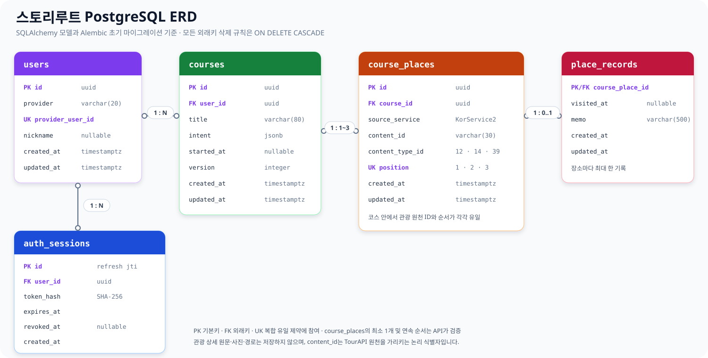

# 스토리루트 데이터 모델

이 문서는 현재 `app/models.py`와 Alembic 초기 마이그레이션에 구현된 영속 데이터 구조를 빠르게 파악하기 위한 요약이다. 테이블과 제약의 상세 설명은 [DATABASE_SCHEMA.md](./DATABASE_SCHEMA.md)를 기준으로 한다.

## ERD

[Mermaid 원본](./assets/storyroute-erd.mmd)

## 관계와 책임

| 테이블 | 책임 | 핵심 관계 |
|---|---|---|
| `users` | 카카오 계정을 서비스 내부 사용자로 식별 | 한 사용자가 여러 로그인 세션과 코스를 가질 수 있다. |
| `auth_sessions` | 리프레시 토큰 원문 대신 SHA-256 해시와 만료·폐기 시각 저장 | `user_id`가 `users.id`를 참조한다. |
| `courses` | 코스 제목과 검증된 여행 조건 `intent` 저장 | `user_id`가 소유자를 가리킨다. |
| `course_places` | TourAPI 장소 ID, 콘텐츠 유형, 코스 안의 방문 순서 저장 | 한 코스에 API 기준 1~3개가 속한다. |
| `place_records` | 코스 장소별 방문 시각과 개인 메모를 계정에 동기화하기 위한 구조 | `course_place_id`가 기본키이자 외래키라 장소마다 최대 한 행이다. |

모든 외래키에는 `ON DELETE CASCADE`가 적용된다. 사용자를 삭제하면 세션·코스·장소·기록이 함께 삭제되고, 코스를 삭제하면 그 코스의 장소와 기록이 삭제된다.

## 핵심 무결성 규칙

- `users`: `(provider, provider_user_id)`가 유일하며 현재 제공자는 `kakao`만 허용한다.
- `courses`: `intent`는 JSON 객체이고 `version`은 양수다. `courses(user_id, updated_at DESC)` 인덱스로 최근 코스를 조회한다.
- `course_places`: `(course_id, source_service, content_id)`와 `(course_id, position)`이 각각 유일하다. `position`은 1~3, `content_type_id`는 관광지 `12`·문화시설 `14`·음식점 `39`만 허용한다.
- 코스에 최소 한 장소가 있는지와 순서가 중간에 비지 않는지는 코스 저장 API가 검증한다. DB 제약만으로 최소 개수와 연속 순서까지 보장하지는 않는다.

## 저장 경계와 현재 한계

PostgreSQL에는 계정·인증 세션·계정에 저장한 코스만 영속화한다. `course_places.content_id`는 TourAPI의 `KorService2` 원천을 가리키는 논리 식별자이며 외래키가 아니다. 관광지 이름, 소개 원문, 사진, 운영시간, AI 설명과 자동차 경로는 DB에 복제하지 않고 필요할 때 외부 API에서 다시 조회한다.

비로그인 코스와 현재 여행 진행 기록은 브라우저 `localStorage`에 저장한다.

- `storyroute.day-trip.v2`: 장소 ID 1~3개, 여행 조건, 저장 시각
- `storyroute.journey.v1:<장소 ID 조합>`: 시작 시각, 방문한 장소 ID, 장소별 메모

따라서 브라우저 기록은 다른 기기와 자동 동기화되지 않으며 GPS 방문 인증을 뜻하지 않는다. `place_records` 테이블은 만들어져 있지만 현재 계정 API와 연결되지 않아, 방문 체크와 메모는 아직 브라우저 기록을 사용한다. `courses.started_at`과 `courses.version`도 이후 여행 시작 동기화와 수정 충돌 처리를 위한 필드로 현재 화면에서는 사용하지 않는다.

## 구현 기준 파일

- [SQLAlchemy 모델](../app/models.py)
- [초기 Alembic 마이그레이션](../migrations/versions/20260918_01_계정_코스_방문_기록_초기_테이블.py)
- [계정 코스 API](../app/api/v1/endpoints/account_courses.py)
- [브라우저 코스 저장](../web/lib/storyroute/storage.ts)
- [브라우저 여행 기록](../web/lib/storyroute/journey.ts)
