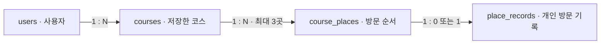

# PostgreSQL 연결·도입 계획

2026년 9월 18일 · 실제 로컬 연결 확인과 계정 저장 계획

## 선택한 DB와 현재 상태

서버에 저장하는 데이터는 PostgreSQL로 관리한다. SQLAlchemy 2·Psycopg 3 연결 코드와 실제 연결 확인 API를 추가하고 Docker의 PostgreSQL 17.11에서 임시 데이터 저장·수정·조회를 확인했다. 현재 구현된 코스·방문 체크·메모는 브라우저의 localStorage에 저장된다. 계정 테이블, 마이그레이션, 계정 저장 API는 아직 만들지 않았다. DB 연결 성공을 기기 간 동기화 완료로 표현하지 않는다.

계정 저장을 구현할 때 연결 흐름은 React → FastAPI → PostgreSQL로 구성한다. 프런트는 내부 API를 사용하고 FastAPI가 로그인한 사용자와 데이터 소유권을 확인한다. DB 비밀번호와 연결 주소는 서버 환경변수에서 관리한다.

## 현재 PC에서 로컬 실행

9월 18일 17:03 Docker 엔진의 정상 실행을 확인한 뒤 `compose.yaml`로 PostgreSQL 컨테이너를 실행했다. 앞서 Docker 시작 오류 때문에 사용한 Windows PostgreSQL은 중지했다. 전환 전에 해당 프로젝트 DB에 사용자 테이블이 없는지 확인했으며 기존 5432 포트의 별도 PostgreSQL은 변경하지 않았다.

| 항목 | 현재 설정 |
|---|---|
| 호스트·포트 | `127.0.0.1:55432` |
| DB 이름 | `storyroute` |
| 실행 방식 | Docker Compose, PostgreSQL 17.11 |
| Docker Desktop 그룹 | `storyroute-local-db` |
| 컨테이너 | `storyroute-local-db-postgres-1` |
| 저장 볼륨 | `storyroute-local-db_postgres_data` |
| 인증 | 서버 `.env`의 로컬 DB 비밀번호, SCRAM |
| 연결 풀 | 프로세스당 최대 2개, 연결 확인 후 재사용 |
| 시간 제한 | 연결·풀 대기 5초, 쿼리 실행 5초 |

Docker Desktop을 켠 뒤 프로젝트 루트에서 실행한다.

```powershell
# 실행 및 준비 상태 확인
docker compose up -d --wait

# 실제 연결과 한국어 데이터 저장·수정·조회 확인
.\.venv\Scripts\python.exe -X utf8 tools/check_local_db.py

# 상태 확인
docker compose ps

# 개발을 마치고 DB 중지
docker compose stop
```

확인 스크립트는 임시 테이블만 만들며 트랜잭션 완료 후 제거한다. 사용자·코스 테이블이나 실제 방문 기록은 만들지 않는다. 외부 AI·관광 API도 호출하지 않는다.

새 PC에서 Docker를 사용할 때는 서버 `.env`의 `STORYROUTE_DB_NAME`, `STORYROUTE_DB_USER`, `STORYROUTE_DB_PASSWORD`, `STORYROUTE_DB_PORT`를 설정한다. `DATABASE_URL`의 사용자·비밀번호·DB·포트를 같은 값으로 맞춘다. URI 비밀번호의 특수문자는 URL 인코딩한다. 초기화된 저장 볼륨의 비밀번호는 환경파일 수정만으로 바뀌지 않는다.

Docker 데이터는 프로젝트 전용 볼륨에 저장된다. 일반 중지는 볼륨을 유지한다. 운영 DB 연결 주소와 비밀번호는 프런트 환경파일에 넣지 않는다.

### 현재 PC의 Windows PostgreSQL 대체 실행

이전에 초기화한 PostgreSQL 17.6 데이터 폴더는 `%LOCALAPPDATA%\StoryRoute\Tourism\postgres17`에 남아 있다. Docker 실행이 어려울 때 사용할 수 있는 별도 DB이며 Docker 볼륨과 데이터를 공유하지 않는다. 같은 55432 포트를 사용하므로 먼저 컨테이너를 중지한다. 아래 관리 스크립트는 이 PC에 초기화한 인스턴스용이다.

```powershell
docker compose stop
.\tools\local_postgres.ps1 -Action start
.\.venv\Scripts\python.exe -X utf8 tools/check_local_db.py
.\tools\local_postgres.ps1 -Action status

# 다시 Docker를 사용할 때
.\tools\local_postgres.ps1 -Action stop
docker compose up -d --wait
```

사용자 데이터 저장을 구현한 뒤 실행 방식을 바꿀 때는 필요한 데이터를 별도로 내보내고 복원한다.

## FastAPI 연결 확인

`GET /api/v1/health/database`는 설정 유무만 검사하지 않고 실제 `SELECT 1`을 실행한다. 성공 응답은 다음과 같다.

```json
{"status":"ok","database":"postgresql"}
```

미설정은 HTTP 503·`DATABASE_NOT_CONFIGURED`, 연결 실패는 HTTP 503·`DATABASE_UNAVAILABLE`을 반환하며 연결 주소·비밀번호·외부 오류 원문은 숨긴다. DB 중단 중에도 `/healthz`와 관광 준비 상태 조회는 유지된다.

이번에는 기존 8000 서버를 종료하지 않고 새 코드 검증용 서버를 8001에 추가했다. 실제 확인 주소는 <http://127.0.0.1:8001/api/v1/health/database>다. 이후 일반 백엔드를 새 코드로 시작하면 같은 API를 해당 서버 포트에서 사용할 수 있다.

9월 18일 16:53 로컬 DB 중지 → 실제 API 503 → 기본 상태 200 유지 → DB 재실행 → 실제 읽기·쓰기와 API 200 복구까지 확인했다. 기본 코스 화면의 브라우저 저장과 계정 DB 저장은 구분한다.

17:03 Docker 컨테이너 전환 후 동일한 서버 환경 설정으로 한국어 임시 데이터 저장·수정·조회·정리와 위 연결 확인 API의 HTTP 200을 다시 확인했다. 백엔드는 재시작하지 않았으며 이전 연결 풀에서 새 PostgreSQL로 연결이 복구됐다.

## 비용을 줄이는 운영 구성

권장 구성은 Vercel Hobby 프런트, Render Free FastAPI, Supabase Free PostgreSQL이다. 배포 업체와 DB 프로젝트는 아직 생성하지 않았으며 무료 한도 안에서 월 고정 비용 0원을 목표로 한다. 외부 AI·길찾기 등 API 사용료는 호스팅 비용과 별도로 관리한다.

9월 18일 [Supabase 공식 요금표](https://supabase.com/pricing) 확인 기준으로 Free 요금제는 PostgreSQL DB 500MB, 파일 저장소 1GB, 송신량 5GB를 포함한다. 리뷰 사진의 파일 저장소는 해당 기능을 구현할 때 사용한다. 무료 프로젝트는 한 주 동안 활동이 부족하면 일시 중지될 수 있고 자동 백업은 제공되지 않는다. 이용량을 확인하고 필요한 데이터는 별도로 내보낸다. [프로젝트 일시 중지 안내](https://supabase.com/docs/guides/platform/free-project-pausing)

FastAPI처럼 계속 실행되는 서버는 일반 PostgreSQL 연결을 사용한다. 배포 환경의 IPv6 지원 여부를 확인하고 IPv4 연결이 필요하면 Supabase의 Session pooler 주소를 사용한다. 실제 주소는 프로젝트의 Connect 화면에서 확인하며 TLS를 사용한다. [공식 PostgreSQL 연결 안내](https://supabase.com/docs/guides/database/connecting-to-postgres)

## 먼저 저장할 데이터

아래는 테이블 설계안이며 생성된 테이블 목록이 아니다. 공개 리뷰와 사진 업로드는 이후 작업으로 남긴다.

| 테이블 | 용도 | 주요 관계·조건 |
|---|---|---|
| `users` | 로그인한 사용자의 내부 ID와 외부 로그인 식별자 | 로그인 제공자·외부 사용자 ID 조합은 중복 불가 |
| `courses` | 사용자의 코스 이름·검색 조건·여행 시작 시각 | 사용자 ID를 외래키로 연결 |
| `course_places` | 코스에 담은 관광 장소 ID·유형·방문 순서 | 코스 내 같은 장소와 같은 순서 중복 방지, 최대 세 장소는 서버에서 검증 |
| `place_records` | 코스 장소별 방문 체크·개인 메모·수정 시각 | 코스 장소당 한 기록, 메모 최대 500자 |



관광 장소는 제공 서비스의 ID와 콘텐츠 유형으로 식별한다. 관광 소개·이미지 원본을 DB에 대량 복제하지 않고 코스를 다시 열 때 실제 관광정보를 조회한다. 방문 순서를 바꿀 때 코스 장소의 ID를 유지해 기존 기록과 연결한다.

사진 리뷰를 추가할 때는 개인 메모와 공개 리뷰를 별도로 저장한다. 사진 파일은 파일 저장소에 두고 DB에는 저장소 경로와 메타데이터를 저장한다. 개인 메모를 자동으로 공개 리뷰로 전환하지 않는다.

## 구현 순서와 완료 기준

1. 로컬 연결 확인은 완료했다. 운영용 무료 PostgreSQL 프로젝트를 만들고 실제 운영 연결·테이블 변경 기록을 구성한다.
2. 로그인한 사용자를 내부 사용자 ID와 연결하고, 다른 사용자의 코스를 읽거나 수정하지 못하도록 검증한다.
3. 계정별 코스 저장·목록·조회·수정·삭제 API를 만든다. 코스와 장소 순서 변경은 하나의 트랜잭션으로 처리한다.
4. 방문 체크·개인 메모를 연결하고, 브라우저 기록을 계정에 가져오는 작업은 사용자가 명시적으로 선택하게 한다.
5. 재접속·서버 재시작·다른 기기에서 저장 복원, 접근 권한, 저장 실패와 동시 수정 처리를 검증한다.

DB 연결만 성공한 상태와 화면에서 계정 저장을 끝까지 검증한 상태는 구분해 기록한다. 공개 사진 리뷰는 계정 저장이 안정된 뒤 진행한다.
