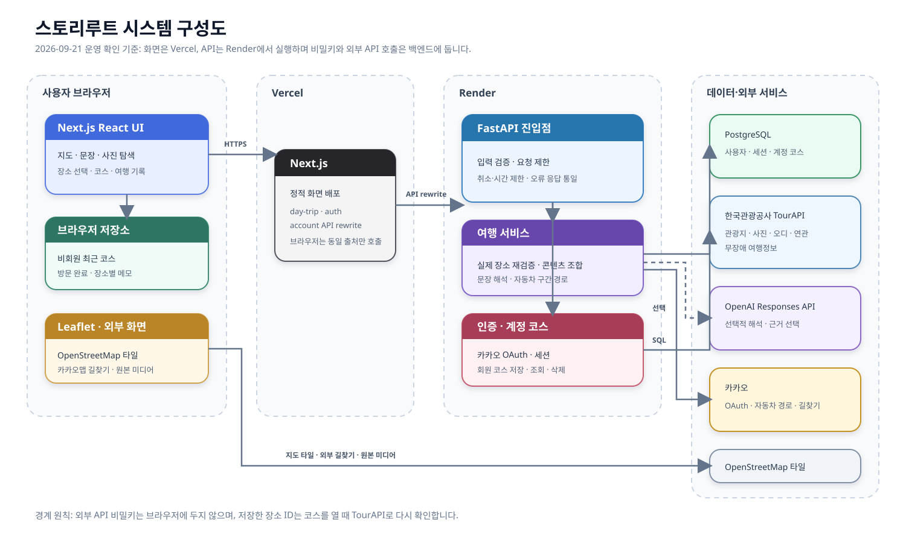

# 스토리루트 시스템 구조

이 문서는 현재 배포 코드의 요청 경로와 저장 경계를 설명한다. 기능 아이디어가 아니라 `web/`, `app/`과 2026년 9월 21일 확인한 Vercel·Render 운영 배포를 기준으로 한다.

## 전체 구성

[Mermaid 원본](./assets/storyroute-system-architecture.mmd)

## 운영 주소

| 역할 | 주소 | 확인 기준 |
|---|---|---|
| 사용자 화면 | <https://storyroute.vercel.app> | 2026-09-21 배포 화면 응답 |
| FastAPI | <https://storyroute-api.onrender.com> | `/healthz`, `/api/v1/day-trip/status` 응답 |

운영 주소는 배포 설정에 따라 바뀔 수 있다. 프런트의 실제 백엔드 대상은 Vercel 환경변수 `API_BASE_URL`과 `web/next.config.ts`의 rewrite로 결정한다.

## 요청이 흐르는 순서

1. 사용자는 Vercel에 배포된 Next.js 화면을 연다.
2. 프런트는 외부 관광 API를 직접 호출하지 않고 동일 출처의 `/api/v1/day-trip/*`, `/api/v1/auth/*`, `/api/v1/account/*`를 호출한다.
3. `web/next.config.ts`가 해당 요청을 Render의 FastAPI로 전달한다.
4. FastAPI는 입력과 장소 ID를 검증한 뒤 TourAPI, OpenAI, 카카오 API를 필요한 범위에서 호출한다.
5. 프런트는 사용자가 취소한 요청이나 뒤늦게 도착한 오래된 응답을 무시하고, 기존 입력과 검색 결과를 유지한다.

이 구조는 인증키를 브라우저 번들에서 숨기고 CORS와 배포 주소 차이를 한 곳에서 처리한다. Render 무료 인스턴스가 잠들어 있으면 첫 요청이 느릴 수 있으므로 화면 진입 시 상태 요청으로 서버를 미리 깨운다. 사용자는 그 확인이 끝나기 전에도 검색을 시작할 수 있고, 8초 이상 걸리는 요청은 화면에서 취소할 수 있다.

## 구성 요소의 책임

| 구성 요소 | 책임 |
|---|---|
| Next.js·React | 세 가지 탐색 방식, 조건 편집, 장소 선택, 코스·여행 화면, 접근 가능한 상태 안내 |
| Next.js rewrite | 브라우저의 `/api/v1/day-trip`, `/api/v1/auth`, `/api/v1/account` 요청을 백엔드로 전달 |
| FastAPI | 요청 검증, 분당 요청 제한, 표준 오류 응답, 외부 API 조합과 부분 실패 처리 |
| DayTrip·Content 서비스 | 강원도 실제 장소 검색·재검증, 관광사진·오디·연관·무장애 정보 대조 |
| Route 서비스 | 현재 장소 순서를 다시 검증하고 카카오모빌리티의 자동차 시간·거리·도로 좌표 조회 |
| PostgreSQL | 카카오 사용자, 인증 세션, 로그인 사용자가 저장한 코스와 장소 순서 보관 |
| 브라우저 `localStorage` | 비회원 최근 코스, 방문 완료, 장소별 메모 보관 |

## 외부 데이터 사용 원칙

- **한국관광공사**: 장소명·주소·좌표·소개·사진·오디오·연관 관광지·무장애 정보를 제공한다. 자료가 없으면 임의 값을 만들지 않는다.
- **OpenAI**: 설정된 경우에만 문장을 여행 조건으로 해석하고 소개 원문에서 근거를 고른다. 실제 장소 검색과 장소 검증은 TourAPI 결과가 기준이다.
- **카카오**: 로그인과 자동차 구간 경로를 서버에서 처리한다. 사용자가 길찾기 버튼을 누르면 카카오맵의 공개 길찾기 화면도 연다.
- **OpenStreetMap**: Leaflet 지도 배경 타일로 사용한다. 코스의 방문 순서와 카카오에서 받은 도로 경로를 그 위에 표시한다.

## 인증과 저장 경계

로그인하지 않아도 전체 탐색·코스 생성·여행 시작을 사용할 수 있다. 비회원의 코스와 여행 기록은 해당 브라우저에만 남는다. 카카오 로그인 사용자는 코스를 PostgreSQL 계정에 추가로 저장해 다른 기기에서 다시 열 수 있다. 코스를 다시 열 때는 저장된 이름이나 소개를 그대로 사용하지 않고 장소 ID를 TourAPI로 재조회한다.

액세스 토큰과 리프레시 토큰은 HttpOnly 쿠키로 전달하며, DB에는 리프레시 토큰 원문이 아닌 해시를 저장한다. 회원 탈퇴 시 사용자와 연결된 세션·계정 코스가 외래키 연쇄 삭제로 함께 제거된다. 현재 방문 완료와 메모는 로그인 여부와 관계없이 브라우저 기록이며 GPS 방문 인증을 의미하지 않는다.

## 장애와 지연 처리

- 프런트 API 요청에는 시간 제한과 `AbortController` 취소가 적용된다.
- 첫 서버 연결 확인이 진행 중이어도 검색 버튼을 잠그지 않는다.
- 검색이 오래 걸리면 진행 이유와 취소 버튼을 보여주고 입력·기존 결과를 보존한다.
- 사진 검색 결과가 없고 키워드가 있다면 같은 지역을 키워드 없이 다시 볼 수 있다.
- 오디·연관 관광지·무장애 정보가 없어도 기본 장소 소개와 코스는 계속 사용할 수 있다.
- 자동차 경로가 일부 실패하면 해당 구간을 실패로 표시하며 임의 시간이나 직선 경로를 만들지 않는다.

## 관련 문서

- [데이터 모델과 ERD](./DATA_MODEL.md)
- [프런트·API 명세](./FRONTEND_API_SPEC.md)
- [인증 API 명세](./AUTH_API_SPEC.md)
- [데이터베이스 상세 구조](./DATABASE_SCHEMA.md)
- [검증 기록](./VALIDATION.md)
