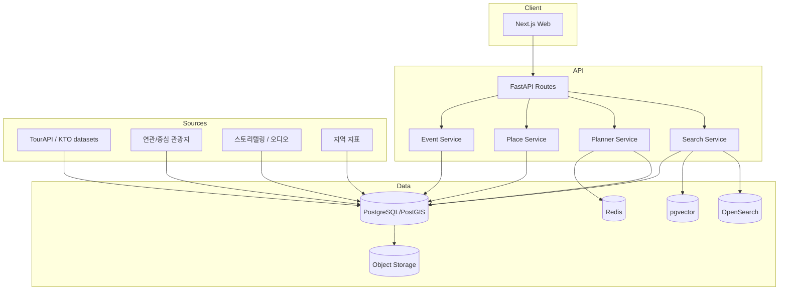
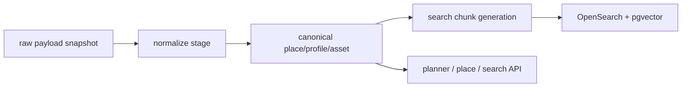

# 08. 시스템 아키텍처 정의서 Final

## 1. Logical Layers

## 2. 요청 흐름

### 검색 흐름
1. 사용자 질의 입력
2. intent extraction
3. filter normalization
4. BM25 + vector retrieval
5. relation expansion
6. UI view model 반환

### 상세 흐름
1. place id 수신
2. canonical place 조회
3. profile / asset / relation / summary 결합
4. detail response 구성

### 플래너 흐름
1. constraint parsing
2. candidate pool 생성
3. scoring
4. itinerary generation
5. validation
6. explanation
7. draft 반환/저장

## 3. 데이터 적재 흐름

## 4. 핵심 서비스 경계

### Search Service
- query parse
- retrieval
- ranking
- search response view model

### Place Service
- canonical read
- detail assembly
- nearby places
- explainability surface

### Planner Service
- slot extraction
- scoring
- validation
- itinerary assembly

### Event Service
- client event intake
- normalization
- fact persistence

## 5. 실패 허용 설계

- search index 실패 → PG fallback + reduced result
- relation 데이터 없음 → place-only 결과
- planner generation 실패 → candidate list fallback
- asset 없음 → placeholder rendering
- external API 장애 → fixture/mock 유지

## 6. Observability
- request id
- trace id
- planner run id
- ingestion run id
- search query id
- error category
