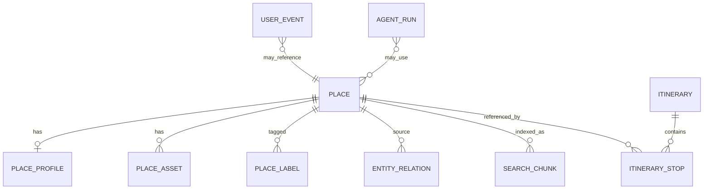

# 10. 데이터 모델 정의서 Final

## 1. 핵심 엔터티

### `place`
장소 마스터. 가장 얇게 유지한다.

주요 필드:
- `place_id`
- `source_content_id`
- `content_type`
- `title`
- `region_code`
- `sigungu_code`
- `lat`
- `lng`
- `address1`
- `address2`
- `thumbnail_url`
- `status`

### `place_profile`
장소 상세 / 확장 속성 통합.

포함:
- 공통정보
- 소개정보
- 반복정보
- accessibility
- pet
- wellness

### `place_asset`
장소에 연결되는 자산.

유형:
- image
- audio
- story
- guidebook_link
- external_link

### `place_label`
배지/태그/인증/큐레이션 라벨.

### `entity_relation`
place ↔ place / place ↔ region / place ↔ content 관계.

유형:
- related_place
- region_hub
- nearby_story
- article_reference

### `search_chunk`
semantic search용 문서 단위.

### `region_metric`
지역 시계열 metric.

### `user_event`
사용자 이벤트 fact.

### `itinerary`
저장 가능한 일정 헤더.

### `itinerary_stop`
일정 내 stop.

### `agent_run`
planner/search agent 실행 로그.

## 2. 최소 테이블 관계

## 3. place를 얇게 유지하는 이유
- place 조회가 가장 잦다
- vector/blob/json 대형 컬럼과 분리해야 성능이 안정적이다
- 원천 API 변경 대응이 쉽다

## 4. 통합 설계 원칙

### 통합한 것
- detail / intro / repeat / accessibility / pet / wellness → `place_profile`
- image / external / narrative → `place_asset`
- article / portal / guidebook → `content resource`(옵션) 또는 asset/link
- search document / chunk / embedding → `search_chunk` 중심
- search session / action / recommendation log → `user_event`

### 끝까지 분리한 것
- `place`
- `place_source_map`
- raw snapshot
- `entity_relation`
- `region_metric`
- `search_chunk`

## 5. 물리 모델 권장 수
- 초기 구현 기준 20~25개 안쪽
- 서비스 MVP 기준으로 충분
- graph / search / analytics 확장 가능

## 6. 필수 인덱스
- `place(region_code, sigungu_code)`
- `place(content_type)`
- `place(lat, lng)` with PostGIS
- `entity_relation(source_id, relation_type)`
- `search_chunk(place_id)`
- `region_metric(region_key, metric_code, metric_date)`
- `user_event(event_name, occurred_at)`
- `itinerary_stop(itinerary_id, day_no, stop_order)`
